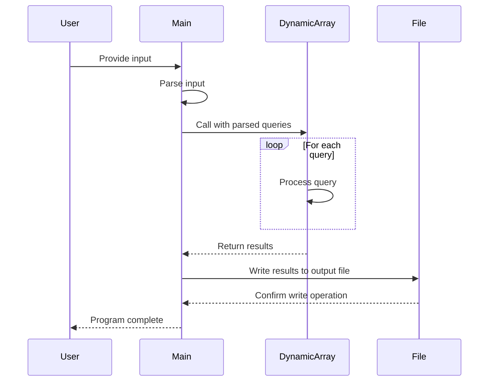

# Dynamic Array Implementation in Rust

This project implements a solution to the Dynamic Array problem using Rust. The program processes a series of queries to manipulate and query multiple sequences, demonstrating efficient use of Rust's standard library and basic input/output operations.

## Problem Description

The Dynamic Array problem involves maintaining `n` sequences and processing two types of queries:

1. Append a value to a sequence.
2. Find a value in a sequence and return it.

The sequences are indexed using a dynamic approach based on the XOR of the given index and the last answer.

## Implementation Details

### Main Components

- `dynamic_array`: The core function that processes queries and returns results.
- `main`: Handles input/output operations and calls the `dynamic_array` function.

### Key Features

- Efficient use of Rust's `Vec` for dynamic arrays.
- Input parsing from stdin.
- Output writing to a file specified by the `OUTPUT_PATH` environment variable.
- Error handling using Rust's `Result` type.

## Sequence Diagram

The following sequence diagram illustrates the flow of the program:



## Usage

To run the program:

1. Ensure you have Rust installed on your system.
2. Set the `OUTPUT_PATH` environment variable if you want to specify a custom output file (default is "output.txt").
3. Provide input through stdin in the following format:
    - First line: Two space-separated integers `n` and `q` (number of sequences and number of queries).
    - Next `q` lines: Three space-separated integers representing each query.

Input example:

```
2 5
1 0 5
1 1 7
1 0 3
2 1 0
2 1 1
```

## Building and Running

To build and run the program:

```bash
cargo build --release
cargo run --release < input.txt
```

Replace `input.txt` with your input file.

## Notes

- The program uses efficient pre-allocation of vectors to optimise performance.
- Error handling is implemented for file operations and input parsing.
